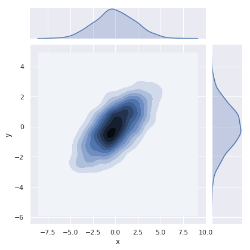
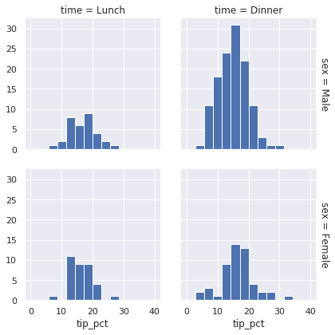

Title: Python Visualization
Date: 2019-03-28 10:20
Tags: python
Slug: blog-1

Having struggled with Python visualizations for a week, I decided to come up with a simple guide to help myself out when it comes to picking up visualization tools for specific plots. There are a number of them and each is good for quite different purposes. 

### matplotlib
Matplotlib is the basis of statistical plotting in Python which many other visualization tools (e.g., pandas and seaborn) are built on. It is very versatile (which means you can plot anything) but can be verbose and complex to implement. Also, the plots produced are often amazingly ugly. Use it for simple and quick basic plots like line plots. Otherwise, avoid it unless you want to make complex, highly customized plots. 

### pandas
Some of the DataFrame inbedded methods are quite convenient to use, such as
- histogram
- scatter plot
- etc

### seaborn
It is well integrated with Pandas DataFrames and has high-level commands (with automatic labelling and grouping) which make plotting easy. It can be the go-to library for a number of well-defined plots such as
- heatmaps (for counts and correlation matrices)
- pairplots (for exploring inter-correlations)
- facetgrid (for plotting multiple subplots in different categories)
- cluster maps (for cluster analysis) # to be added

### altair
Altair is a declarative statistical visualization libary based on Vega and Vega-Lite. It is elegant and simple, and produces **beautiful** plots. It also easily makes interactive plots. In short, it is amazing. Use it whenever you can.


```python
import numpy as np
import pandas as pd
from IPython.display import HTML
```

# Matplotlib

## plt.plot


```python
import matplotlib.pyplot as plt
%matplotlib inline
```


```python
x = np.linspace(0, 10, 30)
y = 3*x + 5
```


```python
plt.plot(x, y)
plt.xlabel('x')
plt.ylabel('y')
```


    Text(0, 0.5, 'y')


```python
plt.figure(figsize=(15,10))

plt.subplot(2,2,1)
plt.plot(x, y, '--', color='red')

plt.subplot(2,2,2)
plt.plot(x, y, 'o', color='black')

plt.subplot(2,2,3)
plt.plot(x, y, '-.', color='c')

plt.subplot(2,2,4)
plt.plot(x, y, 'r--', x, 10*y**2, 'cs', x, y**3, 'm^')
```


    [<matplotlib.lines.Line2D at 0x7f739ab26630>,
     <matplotlib.lines.Line2D at 0x7f739aaccc50>,
     <matplotlib.lines.Line2D at 0x7f739aaccf98>]


# Pandas

## pd.plot

`df.plot` plots the index against each column, so we often need to specify the two columns againts which we want to plot. A often used method is `df.groupby`, which summarizes the data by groups and the group names become the index to be passed to `df.plot`.


```python
df = pd.DataFrame({'x':x, 'y':y})
```


```python
df.plot() # plots the index against each column
```


    <matplotlib.axes._subplots.AxesSubplot at 0x7f739a773da0>


```python
df.plot(x='x',y='y') # so we need to specify the axes
```


    <matplotlib.axes._subplots.AxesSubplot at 0x7f739aa773c8>


```python
df.plot(x='x', y='y', kind='scatter')
```


    <matplotlib.axes._subplots.AxesSubplot at 0x7f739a9e2f60>


```python
df2 = pd.DataFrame({'country':['Australia', 'Australia', 'USA','USA','USA'],
                    'year':[2015, 2016, 1980, 1981, 1982],
                    'unemployment':[6.06, 5.72, 7.14, 7.60, 9.71]})
```


```python
HTML(df2.to_html(classes="table table-stripped table-hover"))
```


<table border="1" class="dataframe table table-stripped table-hover">
  <thead>
    <tr style="text-align: right;">
      <th></th>
      <th>country</th>
      <th>year</th>
      <th>unemployment</th>
    </tr>
  </thead>
  <tbody>
    <tr>
      <th>0</th>
      <td>Australia</td>
      <td>2015</td>
      <td>6.06</td>
    </tr>
    <tr>
      <th>1</th>
      <td>Australia</td>
      <td>2016</td>
      <td>5.72</td>
    </tr>
    <tr>
      <th>2</th>
      <td>USA</td>
      <td>1980</td>
      <td>7.14</td>
    </tr>
    <tr>
      <th>3</th>
      <td>USA</td>
      <td>1981</td>
      <td>7.60</td>
    </tr>
    <tr>
      <th>4</th>
      <td>USA</td>
      <td>1982</td>
      <td>9.71</td>
    </tr>
  </tbody>
</table>


```python
df2.groupby('country')['unemployment'].mean() 
# now it has meaningful index that can be passed directly to .plot()
```


    country
    Australia    5.89
    USA          8.15
    Name: unemployment, dtype: float64


```python
df2.groupby('country')['unemployment'].mean().plot(kind='bar')
```


    <matplotlib.axes._subplots.AxesSubplot at 0x7f739af3a518>


# Seaborn

First, some univariate plots:

## Histograms and KDE


```python
import seaborn as sns
sns.set() # setting the style of Seaborn plots
```


```python
data = np.random.multivariate_normal([0,0],[[5,2],[2,2]], size=2000)
data = pd.DataFrame(data, columns=['x','y'])
```


```python
HTML(data.head().to_html(classes="table table-stripped table-hover"))
```


<table border="1" class="dataframe table table-stripped table-hover">
  <thead>
    <tr style="text-align: right;">
      <th></th>
      <th>x</th>
      <th>y</th>
    </tr>
  </thead>
  <tbody>
    <tr>
      <th>0</th>
      <td>-3.706836</td>
      <td>-2.738933</td>
    </tr>
    <tr>
      <th>1</th>
      <td>1.862120</td>
      <td>1.403838</td>
    </tr>
    <tr>
      <th>2</th>
      <td>-0.116846</td>
      <td>-0.057492</td>
    </tr>
    <tr>
      <th>3</th>
      <td>0.598859</td>
      <td>-0.080863</td>
    </tr>
    <tr>
      <th>4</th>
      <td>0.390465</td>
      <td>0.250044</td>
    </tr>
  </tbody>
</table>


```python
for col in 'xy':
    plt.hist(data[col], normed=True, alpha=0.5)
```

    /home/molly/anaconda3/lib/python3.7/site-packages/matplotlib/axes/_axes.py:6521: MatplotlibDeprecationWarning: 
    The 'normed' kwarg was deprecated in Matplotlib 2.1 and will be removed in 3.1. Use 'density' instead.
      alternative="'density'", removal="3.1")
    /home/molly/anaconda3/lib/python3.7/site-packages/matplotlib/axes/_axes.py:6521: MatplotlibDeprecationWarning: 
    The 'normed' kwarg was deprecated in Matplotlib 2.1 and will be removed in 3.1. Use 'density' instead.
      alternative="'density'", removal="3.1")


```python
sns.kdeplot(data['x'],data['y']) # if both cols passed at the same time
```


    <matplotlib.axes._subplots.AxesSubplot at 0x7f7398608588>


```python
for col in 'xy':
    sns.kdeplot(data[col], shade=True)
    plt.ylim(0, 0.3)
```


```python
sns.distplot(data['x'])
sns.distplot(data['y'])
plt.ylim(0, 0.35)
```


    (0, 0.35)


## jointplot


```python
sns.jointplot('x','y', data, kind='kde')
```


    <seaborn.axisgrid.JointGrid at 0x7f7398440d30>





## pairplot

Joint plots for more than two dimensions. Useful for exploring multivariate correlations.


```python
iris = sns.load_dataset('iris')
HTML(iris.head().to_html(classes="table table-stripped table-hover"))
```


<table border="1" class="dataframe table table-stripped table-hover">
  <thead>
    <tr style="text-align: right;">
      <th></th>
      <th>sepal_length</th>
      <th>sepal_width</th>
      <th>petal_length</th>
      <th>petal_width</th>
      <th>species</th>
    </tr>
  </thead>
  <tbody>
    <tr>
      <th>0</th>
      <td>5.1</td>
      <td>3.5</td>
      <td>1.4</td>
      <td>0.2</td>
      <td>setosa</td>
    </tr>
    <tr>
      <th>1</th>
      <td>4.9</td>
      <td>3.0</td>
      <td>1.4</td>
      <td>0.2</td>
      <td>setosa</td>
    </tr>
    <tr>
      <th>2</th>
      <td>4.7</td>
      <td>3.2</td>
      <td>1.3</td>
      <td>0.2</td>
      <td>setosa</td>
    </tr>
    <tr>
      <th>3</th>
      <td>4.6</td>
      <td>3.1</td>
      <td>1.5</td>
      <td>0.2</td>
      <td>setosa</td>
    </tr>
    <tr>
      <th>4</th>
      <td>5.0</td>
      <td>3.6</td>
      <td>1.4</td>
      <td>0.2</td>
      <td>setosa</td>
    </tr>
  </tbody>
</table>


```python
sns.pairplot(iris,hue='species',size=2.5)
```

    /home/molly/anaconda3/lib/python3.7/site-packages/seaborn/axisgrid.py:2065: UserWarning: The `size` parameter has been renamed to `height`; pleaes update your code.
      warnings.warn(msg, UserWarning)


    <seaborn.axisgrid.PairGrid at 0x7f739a8c2e80>


## facetgrid

To make histograms on subsets of categories.


```python
tips = sns.load_dataset('tips')
HTML(tips.head().to_html(classes="table table-stripped table-hover"))
```


<table border="1" class="dataframe table table-stripped table-hover">
  <thead>
    <tr style="text-align: right;">
      <th></th>
      <th>total_bill</th>
      <th>tip</th>
      <th>sex</th>
      <th>smoker</th>
      <th>day</th>
      <th>time</th>
      <th>size</th>
    </tr>
  </thead>
  <tbody>
    <tr>
      <th>0</th>
      <td>16.99</td>
      <td>1.01</td>
      <td>Female</td>
      <td>No</td>
      <td>Sun</td>
      <td>Dinner</td>
      <td>2</td>
    </tr>
    <tr>
      <th>1</th>
      <td>10.34</td>
      <td>1.66</td>
      <td>Male</td>
      <td>No</td>
      <td>Sun</td>
      <td>Dinner</td>
      <td>3</td>
    </tr>
    <tr>
      <th>2</th>
      <td>21.01</td>
      <td>3.50</td>
      <td>Male</td>
      <td>No</td>
      <td>Sun</td>
      <td>Dinner</td>
      <td>3</td>
    </tr>
    <tr>
      <th>3</th>
      <td>23.68</td>
      <td>3.31</td>
      <td>Male</td>
      <td>No</td>
      <td>Sun</td>
      <td>Dinner</td>
      <td>2</td>
    </tr>
    <tr>
      <th>4</th>
      <td>24.59</td>
      <td>3.61</td>
      <td>Female</td>
      <td>No</td>
      <td>Sun</td>
      <td>Dinner</td>
      <td>4</td>
    </tr>
  </tbody>
</table>


```python
tips['tip_pct'] = 100*tips['tip']/tips['total_bill']
```


```python
HTML(tips.head().to_html(classes="table table-stripped table-hover"))
```


<table border="1" class="dataframe table table-stripped table-hover">
  <thead>
    <tr style="text-align: right;">
      <th></th>
      <th>total_bill</th>
      <th>tip</th>
      <th>sex</th>
      <th>smoker</th>
      <th>day</th>
      <th>time</th>
      <th>size</th>
      <th>tip_pct</th>
    </tr>
  </thead>
  <tbody>
    <tr>
      <th>0</th>
      <td>16.99</td>
      <td>1.01</td>
      <td>Female</td>
      <td>No</td>
      <td>Sun</td>
      <td>Dinner</td>
      <td>2</td>
      <td>5.944673</td>
    </tr>
    <tr>
      <th>1</th>
      <td>10.34</td>
      <td>1.66</td>
      <td>Male</td>
      <td>No</td>
      <td>Sun</td>
      <td>Dinner</td>
      <td>3</td>
      <td>16.054159</td>
    </tr>
    <tr>
      <th>2</th>
      <td>21.01</td>
      <td>3.50</td>
      <td>Male</td>
      <td>No</td>
      <td>Sun</td>
      <td>Dinner</td>
      <td>3</td>
      <td>16.658734</td>
    </tr>
    <tr>
      <th>3</th>
      <td>23.68</td>
      <td>3.31</td>
      <td>Male</td>
      <td>No</td>
      <td>Sun</td>
      <td>Dinner</td>
      <td>2</td>
      <td>13.978041</td>
    </tr>
    <tr>
      <th>4</th>
      <td>24.59</td>
      <td>3.61</td>
      <td>Female</td>
      <td>No</td>
      <td>Sun</td>
      <td>Dinner</td>
      <td>4</td>
      <td>14.680765</td>
    </tr>
  </tbody>
</table>


```python
grid = sns.FacetGrid(tips, row='sex', col='time', margin_titles=True)
grid.map(plt.hist, 'tip_pct', bins=np.linspace(0,40,15))
# bins make sure every graph has the same x scale
```


    <seaborn.axisgrid.FacetGrid at 0x7f739759b908>





Next, some multivariate plots:

## factorplot


```python
with sns.axes_style(style='ticks'): # applying the style to the whole block
    g = sns.factorplot('day','total_bill','sex',data=tips, kind='box', 
                       palette='pastel')
    g.set_axis_labels('Day','Total Bill')
```

    /home/molly/anaconda3/lib/python3.7/site-packages/seaborn/categorical.py:3666: UserWarning: The `factorplot` function has been renamed to `catplot`. The original name will be removed in a future release. Please update your code. Note that the default `kind` in `factorplot` (`'point'`) has changed `'strip'` in `catplot`.
      warnings.warn(msg)


```python
planets = sns.load_dataset('planets')
HTML(planets.head().to_html(classes="table table-stripped table-hover"))
```


<table border="1" class="dataframe table table-stripped table-hover">
  <thead>
    <tr style="text-align: right;">
      <th></th>
      <th>method</th>
      <th>number</th>
      <th>orbital_period</th>
      <th>mass</th>
      <th>distance</th>
      <th>year</th>
    </tr>
  </thead>
  <tbody>
    <tr>
      <th>0</th>
      <td>Radial Velocity</td>
      <td>1</td>
      <td>269.300</td>
      <td>7.10</td>
      <td>77.40</td>
      <td>2006</td>
    </tr>
    <tr>
      <th>1</th>
      <td>Radial Velocity</td>
      <td>1</td>
      <td>874.774</td>
      <td>2.21</td>
      <td>56.95</td>
      <td>2008</td>
    </tr>
    <tr>
      <th>2</th>
      <td>Radial Velocity</td>
      <td>1</td>
      <td>763.000</td>
      <td>2.60</td>
      <td>19.84</td>
      <td>2011</td>
    </tr>
    <tr>
      <th>3</th>
      <td>Radial Velocity</td>
      <td>1</td>
      <td>326.030</td>
      <td>19.40</td>
      <td>110.62</td>
      <td>2007</td>
    </tr>
    <tr>
      <th>4</th>
      <td>Radial Velocity</td>
      <td>1</td>
      <td>516.220</td>
      <td>10.50</td>
      <td>119.47</td>
      <td>2009</td>
    </tr>
  </tbody>
</table>


```python
with sns.axes_style('white'):
    g = sns.factorplot('year', data=planets, aspect=1.5, kind='count')
    g.set_xticklabels(step=5)
```

    /home/molly/anaconda3/lib/python3.7/site-packages/seaborn/categorical.py:3666: UserWarning: The `factorplot` function has been renamed to `catplot`. The original name will be removed in a future release. Please update your code. Note that the default `kind` in `factorplot` (`'point'`) has changed `'strip'` in `catplot`.
      warnings.warn(msg)


```python
with sns.axes_style('white'):
    g = sns.factorplot('year', data=planets, aspect=4, kind='count',
                       hue='method', order=range(2010,2015))
    g.set_ylabels('Number of Planets Discovered')
```

    /home/molly/anaconda3/lib/python3.7/site-packages/seaborn/categorical.py:3666: UserWarning: The `factorplot` function has been renamed to `catplot`. The original name will be removed in a future release. Please update your code. Note that the default `kind` in `factorplot` (`'point'`) has changed `'strip'` in `catplot`.
      warnings.warn(msg)


## lmplot


```python
HTML(tips.head().to_html(classes="table table-stripped table-hover"))
```


<table border="1" class="dataframe table table-stripped table-hover">
  <thead>
    <tr style="text-align: right;">
      <th></th>
      <th>total_bill</th>
      <th>tip</th>
      <th>sex</th>
      <th>smoker</th>
      <th>day</th>
      <th>time</th>
      <th>size</th>
      <th>tip_pct</th>
    </tr>
  </thead>
  <tbody>
    <tr>
      <th>0</th>
      <td>16.99</td>
      <td>1.01</td>
      <td>Female</td>
      <td>No</td>
      <td>Sun</td>
      <td>Dinner</td>
      <td>2</td>
      <td>5.944673</td>
    </tr>
    <tr>
      <th>1</th>
      <td>10.34</td>
      <td>1.66</td>
      <td>Male</td>
      <td>No</td>
      <td>Sun</td>
      <td>Dinner</td>
      <td>3</td>
      <td>16.054159</td>
    </tr>
    <tr>
      <th>2</th>
      <td>21.01</td>
      <td>3.50</td>
      <td>Male</td>
      <td>No</td>
      <td>Sun</td>
      <td>Dinner</td>
      <td>3</td>
      <td>16.658734</td>
    </tr>
    <tr>
      <th>3</th>
      <td>23.68</td>
      <td>3.31</td>
      <td>Male</td>
      <td>No</td>
      <td>Sun</td>
      <td>Dinner</td>
      <td>2</td>
      <td>13.978041</td>
    </tr>
    <tr>
      <th>4</th>
      <td>24.59</td>
      <td>3.61</td>
      <td>Female</td>
      <td>No</td>
      <td>Sun</td>
      <td>Dinner</td>
      <td>4</td>
      <td>14.680765</td>
    </tr>
  </tbody>
</table>


```python
sns.lmplot(x='total_bill', y = 'tip', data=tips)
```


    <seaborn.axisgrid.FacetGrid at 0x7f738f7a7940>


```python
sns.lmplot(x='total_bill', y = 'tip', hue='smoker', data=tips,
          markers=['o','x'])
```


    <seaborn.axisgrid.FacetGrid at 0x7f738eec9cc0>


```python
sns.lmplot(x='total_bill', y = 'tip', hue='smoker', data=tips,
          markers=['o','x'], palette=dict(Yes='g', No='m'))
```


    <seaborn.axisgrid.FacetGrid at 0x7f738eeb0c18>


```python
sns.lmplot(x='total_bill', y = 'tip', hue='day', col='day', 
           data=tips, col_wrap=2)
```


    <seaborn.axisgrid.FacetGrid at 0x7f738ee00ba8>


## heatmap


```python
flights = sns.load_dataset('flights')
HTML(flights.head().to_html(classes="table table-stripped table-hover"))
```


<table border="1" class="dataframe table table-stripped table-hover">
  <thead>
    <tr style="text-align: right;">
      <th></th>
      <th>year</th>
      <th>month</th>
      <th>passengers</th>
    </tr>
  </thead>
  <tbody>
    <tr>
      <th>0</th>
      <td>1949</td>
      <td>January</td>
      <td>112</td>
    </tr>
    <tr>
      <th>1</th>
      <td>1949</td>
      <td>February</td>
      <td>118</td>
    </tr>
    <tr>
      <th>2</th>
      <td>1949</td>
      <td>March</td>
      <td>132</td>
    </tr>
    <tr>
      <th>3</th>
      <td>1949</td>
      <td>April</td>
      <td>129</td>
    </tr>
    <tr>
      <th>4</th>
      <td>1949</td>
      <td>May</td>
      <td>121</td>
    </tr>
  </tbody>
</table>


```python
flights = flights.pivot(index='month', columns='year', values='passengers')
```


```python
HTML(flights.head().to_html(classes="table table-stripped table-hover"))
```


<table border="1" class="dataframe table table-stripped table-hover">
  <thead>
    <tr style="text-align: right;">
      <th>year</th>
      <th>1949</th>
      <th>1950</th>
      <th>1951</th>
      <th>1952</th>
      <th>1953</th>
      <th>1954</th>
      <th>1955</th>
      <th>1956</th>
      <th>1957</th>
      <th>1958</th>
      <th>1959</th>
      <th>1960</th>
    </tr>
    <tr>
      <th>month</th>
      <th></th>
      <th></th>
      <th></th>
      <th></th>
      <th></th>
      <th></th>
      <th></th>
      <th></th>
      <th></th>
      <th></th>
      <th></th>
      <th></th>
    </tr>
  </thead>
  <tbody>
    <tr>
      <th>January</th>
      <td>112</td>
      <td>115</td>
      <td>145</td>
      <td>171</td>
      <td>196</td>
      <td>204</td>
      <td>242</td>
      <td>284</td>
      <td>315</td>
      <td>340</td>
      <td>360</td>
      <td>417</td>
    </tr>
    <tr>
      <th>February</th>
      <td>118</td>
      <td>126</td>
      <td>150</td>
      <td>180</td>
      <td>196</td>
      <td>188</td>
      <td>233</td>
      <td>277</td>
      <td>301</td>
      <td>318</td>
      <td>342</td>
      <td>391</td>
    </tr>
    <tr>
      <th>March</th>
      <td>132</td>
      <td>141</td>
      <td>178</td>
      <td>193</td>
      <td>236</td>
      <td>235</td>
      <td>267</td>
      <td>317</td>
      <td>356</td>
      <td>362</td>
      <td>406</td>
      <td>419</td>
    </tr>
    <tr>
      <th>April</th>
      <td>129</td>
      <td>135</td>
      <td>163</td>
      <td>181</td>
      <td>235</td>
      <td>227</td>
      <td>269</td>
      <td>313</td>
      <td>348</td>
      <td>348</td>
      <td>396</td>
      <td>461</td>
    </tr>
    <tr>
      <th>May</th>
      <td>121</td>
      <td>125</td>
      <td>172</td>
      <td>183</td>
      <td>229</td>
      <td>234</td>
      <td>270</td>
      <td>318</td>
      <td>355</td>
      <td>363</td>
      <td>420</td>
      <td>472</td>
    </tr>
  </tbody>
</table>


```python
sns.heatmap(flights)
```


    <matplotlib.axes._subplots.AxesSubplot at 0x7f739410c6d8>


```python
df = pd.DataFrame(np.random.randn(35, 35))
```


```python
sns.heatmap(df.corr(),cmap='coolwarm') # divergent color code
```


    <matplotlib.axes._subplots.AxesSubplot at 0x7f739420d898>


# altair


```python
import altair as alt
alt.renderers.enable('notebook')
```


    RendererRegistry.enable('notebook')


```python
cars = alt.load_dataset('cars')
```


```python
HTML(cars.head().to_html(classes="table table-stripped table-hover"))
```


<table border="1" class="dataframe table table-stripped table-hover">
  <thead>
    <tr style="text-align: right;">
      <th></th>
      <th>Acceleration</th>
      <th>Cylinders</th>
      <th>Displacement</th>
      <th>Horsepower</th>
      <th>Miles_per_Gallon</th>
      <th>Name</th>
      <th>Origin</th>
      <th>Weight_in_lbs</th>
      <th>Year</th>
    </tr>
  </thead>
  <tbody>
    <tr>
      <th>0</th>
      <td>12.0</td>
      <td>8</td>
      <td>307.0</td>
      <td>130.0</td>
      <td>18.0</td>
      <td>chevrolet chevelle malibu</td>
      <td>USA</td>
      <td>3504</td>
      <td>1970-01-01</td>
    </tr>
    <tr>
      <th>1</th>
      <td>11.5</td>
      <td>8</td>
      <td>350.0</td>
      <td>165.0</td>
      <td>15.0</td>
      <td>buick skylark 320</td>
      <td>USA</td>
      <td>3693</td>
      <td>1970-01-01</td>
    </tr>
    <tr>
      <th>2</th>
      <td>11.0</td>
      <td>8</td>
      <td>318.0</td>
      <td>150.0</td>
      <td>18.0</td>
      <td>plymouth satellite</td>
      <td>USA</td>
      <td>3436</td>
      <td>1970-01-01</td>
    </tr>
    <tr>
      <th>3</th>
      <td>12.0</td>
      <td>8</td>
      <td>304.0</td>
      <td>150.0</td>
      <td>16.0</td>
      <td>amc rebel sst</td>
      <td>USA</td>
      <td>3433</td>
      <td>1970-01-01</td>
    </tr>
    <tr>
      <th>4</th>
      <td>10.5</td>
      <td>8</td>
      <td>302.0</td>
      <td>140.0</td>
      <td>17.0</td>
      <td>ford torino</td>
      <td>USA</td>
      <td>3449</td>
      <td>1970-01-01</td>
    </tr>
  </tbody>
</table>


```python
alt.Chart(cars).mark_point().encode(
    x='Horsepower',
    y='Miles_per_Gallon',
    color='Origin:N'
)
```


<div class="vega-embed" id="a9bf100c-54ed-47e9-b4af-734ddfb94bbe"></div>

<style>
.vega-embed .vega-actions > a {
    transition: opacity 200ms ease-in;
    opacity: 0.3;
    margin-right: 0.6em;
    color: #444;
    text-decoration: none;
}

.vega-embed .vega-actions > a:hover {
    color: #000;
    text-decoration: underline;
}

.vega-embed:hover .vega-actions > a {
    opacity: 1;
    transition: 0s;
}

.vega-embed .error p {
    color: firebrick;
    font-size: 1.2em;
}
</style>


    


## Faceting


```python
alt.Chart(cars).mark_circle(opacity=0.5).encode(
    x='Horsepower',
    y='Miles_per_Gallon',
    color='Origin'
).facet(column='Origin')
```


<div class="vega-embed" id="d2047693-0f3f-4835-83cd-9f0a3a35571b"></div>

<style>
.vega-embed .vega-actions > a {
    transition: opacity 200ms ease-in;
    opacity: 0.3;
    margin-right: 0.6em;
    color: #444;
    text-decoration: none;
}

.vega-embed .vega-actions > a:hover {
    color: #000;
    text-decoration: underline;
}

.vega-embed:hover .vega-actions > a {
    opacity: 1;
    transition: 0s;
}

.vega-embed .error p {
    color: firebrick;
    font-size: 1.2em;
}
</style>


    


Changing the opacity:


```python
alt.Chart(cars).mark_bar(opacity=0.2).encode(
    x='Horsepower',
    y='Miles_per_Gallon:Q',
    color='Origin'
)
```


<div class="vega-embed" id="683831da-2338-4f49-b8bd-b14d5509fd71"></div>

<style>
.vega-embed .vega-actions > a {
    transition: opacity 200ms ease-in;
    opacity: 0.3;
    margin-right: 0.6em;
    color: #444;
    text-decoration: none;
}

.vega-embed .vega-actions > a:hover {
    color: #000;
    text-decoration: underline;
}

.vega-embed:hover .vega-actions > a {
    opacity: 1;
    transition: 0s;
}

.vega-embed .error p {
    color: firebrick;
    font-size: 1.2em;
}
</style>


    


## Interactions


```python
alt.Chart(cars).mark_point().encode(
    x='Horsepower',
    y='Miles_per_Gallon',
    color='Origin'
).facet(column='Origin').interactive()
```


<div class="vega-embed" id="b707826a-64c3-4af4-ac37-cdd19a2b9cbb"></div>

<style>
.vega-embed .vega-actions > a {
    transition: opacity 200ms ease-in;
    opacity: 0.3;
    margin-right: 0.6em;
    color: #444;
    text-decoration: none;
}

.vega-embed .vega-actions > a:hover {
    color: #000;
    text-decoration: underline;
}

.vega-embed:hover .vega-actions > a {
    opacity: 1;
    transition: 0s;
}

.vega-embed .error p {
    color: firebrick;
    font-size: 1.2em;
}
</style>


    


### Selections

-`selection_single()`: selecting single element at a time

-`selection_multi()`: selecting multiple items at once through clicking or mouseover

-`selection_interval()`: selecting multiple items through brushing


```python
brush = alt.selection_interval()

alt.Chart(cars).mark_point().encode(
    x='Horsepower',
    y='Miles_per_Gallon',
    color=alt.condition(brush, 'Origin', alt.value('lightgray'))
).properties(
    selection=brush
)
```


<div class="vega-embed" id="9b920447-7b4e-4e40-a892-44607043dc52"></div>

<style>
.vega-embed .vega-actions > a {
    transition: opacity 200ms ease-in;
    opacity: 0.3;
    margin-right: 0.6em;
    color: #444;
    text-decoration: none;
}

.vega-embed .vega-actions > a:hover {
    color: #000;
    text-decoration: underline;
}

.vega-embed:hover .vega-actions > a {
    opacity: 1;
    transition: 0s;
}

.vega-embed .error p {
    color: firebrick;
    font-size: 1.2em;
}
</style>


    


## histograms

`count()` aggregation function


```python
alt.Chart(cars).mark_bar().encode(
    alt.X('Horsepower',bin=alt.BinParams(maxbins=40)), # or simply: bin=True
    y='count(*):Q',
    color='Origin'
).facet(column='Origin')
```


<div class="vega-embed" id="cff6dde3-c293-4506-9bf1-b6f3687d3464"></div>

<style>
.vega-embed .vega-actions > a {
    transition: opacity 200ms ease-in;
    opacity: 0.3;
    margin-right: 0.6em;
    color: #444;
    text-decoration: none;
}

.vega-embed .vega-actions > a:hover {
    color: #000;
    text-decoration: underline;
}

.vega-embed:hover .vega-actions > a {
    opacity: 1;
    transition: 0s;
}

.vega-embed .error p {
    color: firebrick;
    font-size: 1.2em;
}
</style>


    


## Layers

Layers with interaction:


```python
# the 'empty' setting akes all text hidden before any mouseover occurs
pointer = alt.selection_single(on='mouseover',nearest=True,empty='none')

base = alt.Chart().encode(
    x='Miles_per_Gallon', 
    y='Horsepower'
)

chart = alt.layer(
    base.mark_point().properties(selection=pointer).encode(color='Origin'),
    base.mark_text(dx=8,dy=3,align='left').encode(text=alt.condition(pointer,'Name',alt.value(''))),
    data=cars
)

chart
```


<div class="vega-embed" id="46346015-4d71-45f7-af56-9dc9b9b96ac3"></div>

<style>
.vega-embed .vega-actions > a {
    transition: opacity 200ms ease-in;
    opacity: 0.3;
    margin-right: 0.6em;
    color: #444;
    text-decoration: none;
}

.vega-embed .vega-actions > a:hover {
    color: #000;
    text-decoration: underline;
}

.vega-embed:hover .vega-actions > a {
    opacity: 1;
    transition: 0s;
}

.vega-embed .error p {
    color: firebrick;
    font-size: 1.2em;
}
</style>


    


